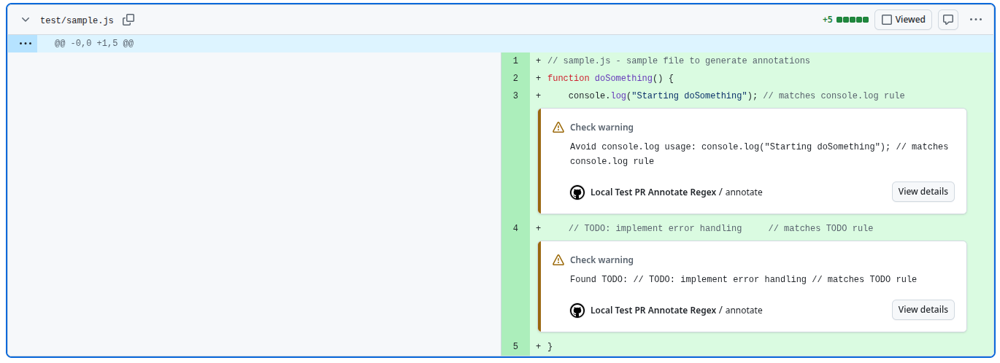

# Regex PR Annotator GitHub Action

**Regex PR Annotator** is a GitHub Action that automatically [annotates](https://github.com/actions/toolkit/tree/main/packages/core#annotations) pull requests by applying configurable regular expression (regex) rules to added lines of code. Use this action to enforce code standards, highlight TODOs, or flag unwanted patterns in your codebase.

> **Important:**  
> The **Regex PR Annotator** Github Action only works with **pull request** events. This GitHub Action will not annotate code on push, workflow_dispatch, or other event types. Make sure your workflow is triggered by `pull_request` events.

## Features

- **Customizable Regex Rules:** Define your own regex patterns to match code smells, TODOs, or forbidden code.
- **Inline PR Annotations:** Automatically add GitHub annotations to pull requests for matched lines.
- **Flexible Configuration:** Set annotation levels (`notice`, `warning`, `error`) and target specific file paths.
- **Easy Integration:** Works out-of-the-box with GitHub Actions workflows.

## Inputs

### `github-token` (optional)
A GitHub token for API calls. Defaults to the `GITHUB_TOKEN` environment variable.

### `rules` (required)
A JSON array of rule objects. Each rule supports:
- `regex`: **string** – The regular expression to test added lines.
- `message`: **string** – Annotation message supporting placeholders:
  - `{regex}`: the rule's regex.
  - `{line}`: the full text of the added line.
  - `{match}`: the matched substring.
- `level`: **string** – Annotation level (`notice`, `warning`, or `error`). Default: `warning`.
- `paths`: **string or array** – Optional regex pattern(s) to filter target files.

## Example: How to Use Regex PR Annotator in Your Workflow

```yaml
name: PR Regex Annotation

on:
  pull_request:
    types: [opened, synchronize]

jobs:
  annotate:
    runs-on: ubuntu-latest
    steps:
      - uses: actions/checkout@v4
      - name: Annotate PR with Regex
        uses: iyaki/regex-pr-annotator@v1
        with:
          rules: |
            [
              {
                "regex": "TODO",
                "level": "warning",
                "message": "Found TODO: {line}",
                "paths": ["\\.js$"]
              },
              {
                "regex": "console\\.log",
                "level": "notice",
                "message": "Avoid console.log: found '{match}'"
              }
            ]
```

## Example Results



[See a sample PR with regex annotations](https://github.com/iyaki/regex-pr-annotator/pull/1/files#diff-988798991edf03e818d5f2d7e0b4c727035102549d0b04330d2de8300281698d)

## Outputs

This GitHub Action does **not** produce any outputs.

## Getting Started: Build and Install

To build the Regex PR Annotator locally:

```shell
npm ci
npm run build
```

## Why Use Regex PR Annotator?

- **Automate code review** for common issues using regex.
- **Improve code quality** by catching unwanted patterns before merging.
- **Save time** by reducing manual review effort.

---

**Regex PR Annotator** – The easiest way to enforce code standards and automate PR feedback with regex
