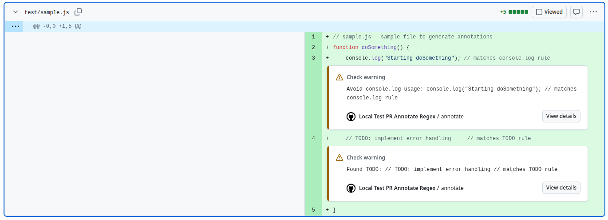

> [!WARNING]
> **This action is deprecated and no longer maintained.**
> Use [reglint/reglint-action](https://github.com/reglint/reglint-action) instead — it covers the same regex-annotation use cases with YAML-defined rules, works on all event types (not just `pull_request`), needs no token, and supports SARIF output.

# Regex PR Annotator GitHub Action

**Regex PR Annotator** is a GitHub Action that automatically [annotates](https://github.com/actions/toolkit/tree/main/packages/core#annotations) pull requests by applying configurable regular expression (regex) rules to added lines of code. Use this action to enforce code standards, highlight TODOs, or flag unwanted patterns in your codebase.

> **Important:**  
> The **Regex PR Annotator** Github Action only works with **pull request** events. This GitHub Action will not annotate code on push, workflow_dispatch, or other event types. Make sure your workflow is triggered by `pull_request` events.

## Migration Guide: Migrate to reglint/reglint-action

[reglint/reglint-action](https://github.com/reglint/reglint-action) is the maintained successor to this action. It runs [RegLint](https://github.com/reglint/reglint), a regex linter with YAML-defined rules, and reports findings as the same native PR annotations — plus SARIF output, and it works on all event types. Migration takes two steps:

### 1. Convert your rules to a YAML file

Create a `reglint-rules.yaml` file in your repository (path configurable via the `config` input). Field mapping:

| Regex PR Annotator | RegLint (`reglint-rules.yaml`) | Notes |
| --- | --- | --- |
| `rules[].regex` (string or JS `RegExp`) | `rules[].regex` (string) | RegLint uses [RE2](https://github.com/google/re2/wiki/Syntax) syntax: no lookaheads or backreferences |
| `rules[].message` with `{match}` / `{line}` | `rules[].message` with capture references (`$1`, `$2`, …) | Wrap the interesting part of the regex in a capture group |
| `rules[].level` (`notice` / `warning` / `error`) | `rules[].severity` | Same level names |
| `rules[].paths` (regex patterns) | `rules[].paths` (globs) | e.g. `"\\\\.js$"` becomes `"**/*.js"` |
| `fail_level` input | `fail-on` input (or `failOn` in the config) | Same level names |
| `github_token` input | — | Not needed; the action requires no token or extra permissions |

Example — the JSON rules from this README convert to:

```yaml
rules:
  - message: "Found TODO: $1"
    regex: "(TODO)"
    severity: "warning"
    paths:
      - "**/*.js"
  - message: "Avoid console.* usage on committed code"
    regex: "console\\.(log|debug|info|warn|error)"
    severity: "error"
```

See the [RegLint configuration docs](https://github.com/reglint/reglint#configuration) for the full rule schema.

### 2. Update your workflow step

Before:

```yaml
- uses: iyaki/regex-pr-annotator@v2.1.0
  with:
    fail_level: 'error'
    rules: |
      [ ...JSON rules... ]
```

After:

```yaml
- uses: reglint/reglint-action@v1.1.0
  with:
    fail-on: error
    config: reglint-rules.yaml
```

Note that reglint-action publishes full `vX.Y.Z` tags only (no moving major tag), so pin an exact version.

### Behavioral differences

- Scans the whole checked-out tree on every run, not just lines added in a PR. To annotate only added lines on pull requests, use the [`--format github` recipe with git diff scoping](https://github.com/reglint/reglint#ci-recipe-pr-annotations-github-actions).
- Matches are reported on the exact file and line across the repository; GitHub caps rendered annotations at 10 per severity per step (full results available as JSON or SARIF).


## Features

- **Customizable Regex Rules:** Define your own regex patterns to match code smells, TODOs, or forbidden code.
- **Inline PR Annotations:** Automatically add GitHub annotations to pull requests for matched lines.
- **Flexible Configuration:** Set annotation levels (`notice`, `warning`, `error`) and target specific file paths.
- **Fail the workflow based on annotation level:** Use `fail_level` to fail the workflow if any annotation matches or exceeds the specified level.
- **Easy Integration:** Works out-of-the-box with GitHub Actions workflows.

## Inputs

### `github_token` (optional)

GitHub token for API calls. Default: `${{ github.token }}`

### `rules` (required)

A JSON array of rule objects, **or a path to a JS file (CommonJS) exporting an array of rules**. Each rule supports:

- `regex`: **string or RegExp** – The regular expression to test added lines.
- `message`: **string** – Annotation message supporting placeholders:
  - `{regex}`: the rule's regex.
  - `{line}`: the full text of the added line.
  - `{match}`: the matched substring.
- `level`: **string** – Annotation level (`notice`, `warning`, or `error`). Default: `warning`.
- `paths`: **string, RegExp, or array** – Optional regex pattern(s) to filter target files.

### `debug` (optional)

Enable debug logging: outputs patches and match info. Default: `false`.

### `fail_level` (optional)

Minimum level (`notice`, `warning`, `error`) that causes the action to fail. Use `none` to never fail. Default: `none`.

## Example: How to Use Regex PR Annotator in Your Workflow

### Using a JSON array

```yaml
name: PR Regex Annotation

on:
  pull_request:
    types: [opened, synchronize]

jobs:
  annotate:
    runs-on: ubuntu-latest
    steps:
      - uses: actions/checkout@v4
      - name: Annotate PR with Regex
        uses: iyaki/regex-pr-annotator@v2.1.0
        with:
          rules: |
            [
              {
                "regex": "TODO",
                "message": "Found TODO: {line}",
                "paths": ["\\.js$"]
              },
              {
                "regex": "console\\.[log|debug|info|warn|error]",
                "level": "error",
                "message": "Avoid console.* usage on commited code"
              }
            ]
```

### Using a JS file (CommonJS)

```yaml
name: PR Regex Annotation

on:
  pull_request:
    types: [opened, synchronize]

jobs:
  annotate:
    runs-on: ubuntu-latest
    steps:
      - uses: actions/checkout@v4
      - name: Annotate PR with Regex
        uses: iyaki/regex-pr-annotator@v2.1.0
        with:
          fail_level: 'error'
          rules: test/rules-sample.js  # See sample file in this repo
```

Where [`test/rules-sample.js`](./test/rules-sample.js) contains:

```js
export default [
  {
    regex: /TODO/,
    message: 'Found TODO: {line}',
    paths: [/\.js$/]
  },
  {
    regex: /console\\.log/,
    level: 'error',
    message: 'Avoid console.log usage on commited code'
  }
]
```

## Example Results



[See a sample PR with regex annotations](https://github.com/iyaki/regex-pr-annotator/pull/1/files#diff-988798991edf03e818d5f2d7e0b4c727035102549d0b04330d2de8300281698d)

## Outputs

This GitHub Action does **not** produce any outputs.

## Getting Started: Build and Install

To build the Regex PR Annotator locally:

```shell
npm ci
npm run build
```

## Why Use Regex PR Annotator?

- **Automate code review** for common issues using regex.
- **Improve code quality** by catching unwanted patterns before merging.
- **Save time** by reducing manual review effort.

---

**Regex PR Annotator** – The easiest way to enforce code standards and automate PR feedback with regex
